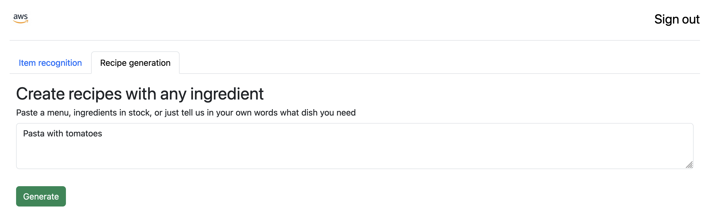

# Inventory AI 

This code provides an example of how to create an end-to-end solution to inference images of food products, detecting the name and brand. Additionally, it allows you to create a recipe from text, including images. It has been optimized to read images that contain a single product only

## Infrastructure

The infrastructure is based on:
1. Amazon API Gateway - Entry point to send images and text 
2. Amazon Lambda Function - Handle requests to detect images and generate recipes
3. Amazon Cognito - Provides authentication for the API
5. Amazon Bedrock - Used for inference requests to Anthropic Claude 3 sonnet and Amazon Titan image models
6. Amazon S3 - Host the web application
7. Amazon Cloudfront - Content delivery network for the web application

Most of the deployment of the infrastructure is automated using the Serverless Application Model. For detail instructions, follows the steps [here](./infrastructure/README.md)

## Web portal

Example single page application built in Vue JS - it is integrated with Cognito to provide a seamlessly experience, allowing users to sign up and sign in. 

Detail instructions to install the web app can be found [here](./web-portal/README.md)

## Support

Please open an issue for any questions or issues
