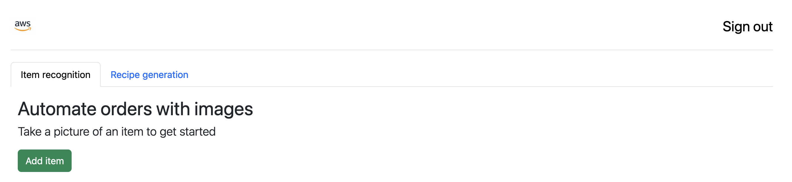

# Inventory AI web portal

A single page application to send images and text to the infrastructure. If accessed via a mobile phone, users can also take a picture directly instead of selecting one from the photo library




## Recommended IDE Setup

[VSCode](https://code.visualstudio.com/) + [Volar](https://marketplace.visualstudio.com/items?itemName=Vue.volar) (and disable Vetur) + [TypeScript Vue Plugin (Volar)](https://marketplace.visualstudio.com/items?itemName=Vue.vscode-typescript-vue-plugin).

## Customize configuration and code

There are two files that need to be changed prior to run the solution:

1. [aws-exports.js](./src/aws-exports.js): The paremeters aws_cognito_region (for example, us-east-1), aws_user_pools_id and aws_user_pools_web_client_id need to be changed for the AWS region, the cognito user pool ID and the client id to be used by this application. The user pool and the client id are created following the steps in [here](../infrastructure/README.md)

    Once they are created, you can find the pool ID in the console or executing this command:

    ```bash
    aws cognito-idp list-user-pools --max-results 60 --query "UserPools[?Name=='InventoryAiUserPool']"
    ```

    The client id can be also be found in the console, in the App Integration tab, or using this command:

    ```bash
    aws cognito-idp list-user-pool-clients --user-pool-id CHANGE_ME_FOR_THE_USER_POOL_ID
    ```

    The aws-export.js file should look similar to this:

    ```json
    const awsmobile = {
        "aws_cognito_region": "us-east-1",
        "aws_user_pools_id": "us-east-1_aabCCCCDD",
        "aws_user_pools_web_client_id": "1234564123456750hckp6pq0rf",
        (...)
    }
    ```

2. [App.vue](./src/App.vue): In line 221 and 282, the API gateway URL needs to be added. You can find the value in the output of the SAM template executed [here](../infrastructure/README.md) or in the console. The code should look like this:

```javascript
(...)
          fetch("https://0123456789.execute-api.us-east-1.amazonaws.com/dev/(...)", {
            "method": "POST",
(...)
```

## Install dependencies

```sh
npm install
```

### Run locally in a development enviroment

```sh
npm run dev
```

### Compile and minify for production

```sh
npm run build
```

The resulting "dist" folder can be copied to a S3 bucket and used as an origin for a cloudfront distribution
